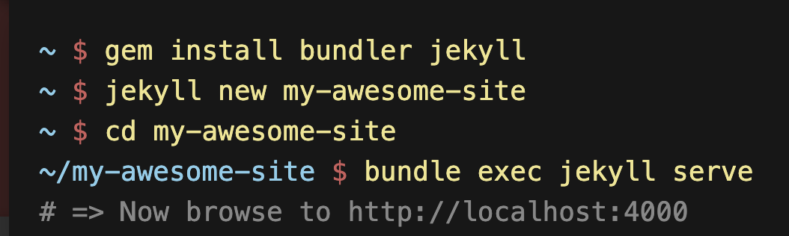

首先，第一步需要有一个GitHub账号。

然后，根据[GitHub Pages](https://pages.github.com/)上指示的步骤就可以写个`Hello World`的网页啦。

当然，不可能以后的博客都写成`html`格式的来提交，这就轮到`Jekyll`出场啦。



这个截图是`Jekyll`官网上的介绍，安装，建站，和本地预览，相当简单。

就是建站完了以后，需要对`_config.yml`和`gemfile`文件进行一些简单的设置。

`gemfile`的修改：

```
gem "jekyll", "~> 4.1.1" # 把这一行去掉
gem "github-pages", group: :jekyll_plugins # 把这一行的注释标志去掉
```

`_config.yml`里面把网站名字，描述等一些相关信息填上。另外，要设置一个文件夹来放置图片。

```
defaults:
  - scope:
      path: "assets/images"
    values:
      image: true
```

需要在网站的文件夹里新建文件夹assets/images，以后添加的图片就放这个文件夹里。

这样就建好一个站了，可以试试用`bundle exec jekyll serve`命令然后在浏览器里用上面图片中的那个地址来预览网站了。

`Jekyll`有个初始的welcome页面提供的，需要注意的是自己新建的post要有格式抬头如下：

```
---
layout: post
title:  "Welcome to Jekyll!"
date:   2020-10-16 14:26:20 +0800
categories: jekyll update
---
```

并且，博客日志的文件名是有固定格式的。`YEAR-MONTH-DAY-title.MARKUP`，其中，年份是4位数，月日都是两位数，标记的格式一般用`markdown`的话写`.md`就可以了。

最后，如果有美观需求，可以定制主题，网上有很多现成的。改主题的操作如下：

添加下面内容到 `Gemfile`，把主题的名字替换成想要的:

```
gem "bulma-clean-theme"
```

添加下面内容到 `_config.yml`:

```
theme: bulma-clean-theme
```

然后执行:

```
$ bundle
```

以上是把主题下载到本地的方法。要在GitHub上面使用的话，只要在`_config.yml`里加上这一句就好了。

```
remote_theme: chrisrhymes/bulma-clean-theme
```

